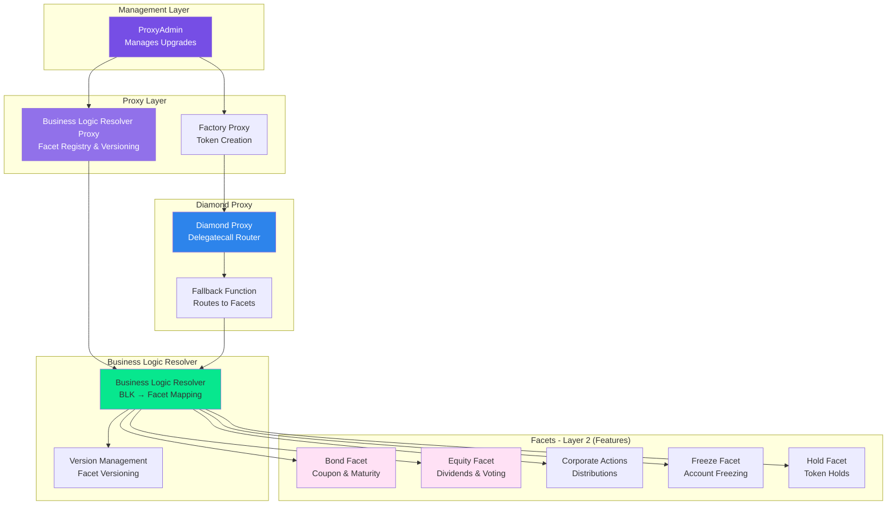

# Contract Overview

Detailed overview of the ATS smart contract architecture and Diamond Pattern implementation.

## What ATS Contracts Do

The Asset Tokenization Studio contracts provide a modular, upgradeable smart contract system for security tokens on Hedera. They implement:

1. **ERC-1400** - Security token standard with partitions and document management
2. **ERC-3643** (Partial T-REX) - Compliance and identity management for security tokens
3. **Diamond Pattern (EIP-2535)** - Modular, upgradeable architecture
4. **Equity Features** - Dividends, voting rights, stock splits
5. **Bond Features** - Coupons, maturity redemption
6. **Compliance** - KYC, whitelisting, transfer restrictions

## Architecture

### Diamond Pattern (EIP-2535)

The ATS contracts use the Diamond Pattern for maximum modularity and upgradeability:



### 4-Layer Hierarchical Design

```
┌─────────────────────────────────────────┐
│         ProxyAdmin                      │
│  (Manages proxy upgrades)               │
└─────────────────────────────────────────┘
                  │
        ┌─────────┴─────────┐
        │                   │
┌───────▼──────────┐  ┌────▼────────────┐
│ BLR Proxy        │  │ Factory Proxy   │
│ (Facet Registry) │  │ (Token Creator) │
└───────┬──────────┘  └─────────────────┘
        │
        ├─ Layer 0: Storage Wrappers
        ├─ Layer 1: Core Logic (ERC-1400, ERC-3643)
        ├─ Layer 2: Domain Features (Bond, Equity, Corporate Actions)
        └─ Layer 3: Jurisdiction-Specific (USA)
```

## Contract Layers

### Layer 0: Storage Wrappers

Provide type-safe access to Diamond storage:

- **ERC1400StorageWrapper** - Token state and partition data
- **KycStorageWrapper** - KYC and identity management
- **CapStorageWrapper** - Supply cap and issuance limits
- **AccessControlStorageWrapper** - Role-based permissions

**Purpose**: Storage isolation per feature for safe upgradeability

### Layer 1: Core Implementation

Base implementations of standards:

- **ERC1400Implementation** - Security token core logic
- **AccessControl** - Role-based access control
- **Freeze** - Account and partial freezing
- **Hold** - Token holds and escrow
- **ControlList** - Whitelisting and blacklisting
- **Common** - Shared logic across facets

**Purpose**: Reusable base logic for all token types

### Layer 2: Domain Features (Facets)

Feature-specific implementations:

**Bond Facets:**

- **BondFacet** - Create bonds, set coupons, manage maturity
- **BondReadFacet** - Read bond information (coupons, maturity)

**Equity Facets:**

- **EquityFacet** - Create equity, set dividends, voting, stock splits

**Scheduled Tasks:**

- **ScheduledTasksFacet** - Snapshots, balance adjustments, cross-ordered tasks

**Corporate Actions:**

- **ProceedRecipientsFacet** - Payment distribution logic

**Purpose**: Each facet is independently upgradeable

### Layer 3: Jurisdiction-Specific

Jurisdiction-specific compliance:

- **bondUSA/** - USA-specific bond features
- **equityUSA/** - USA-specific equity features

**Purpose**: Regulatory compliance per jurisdiction

## Key Components

### Diamond Proxy

Routes function calls to appropriate facets:

- **Delegatecall to facets** - Execute facet code in proxy context
- **Function selector mapping** - Map function signatures to facet addresses
- **Storage layout preservation** - Maintain consistent storage across upgrades
- **Gas-efficient routing** - Minimal overhead for function calls

### Business Logic Resolver (BLR)

Maps Business Logic Keys (BLK) to versioned facet addresses:

- **Versioned facet registry** - Track multiple versions of each facet
- **Dynamic facet lookup** - Resolve facets at runtime
- **Configuration management** - Equity and Bond configurations
- **Upgrade coordination** - Orchestrate multi-facet upgrades

### Factory

Deploys new token instances:

- **Clone diamond proxies** - Create new token contracts
- **Initialize configurations** - Set up equity or bond config
- **Set up permissions** - Grant roles to token admins
- **Deploy identity contracts** - Create compliance infrastructure

### Facets

Modular business logic components:

- **Independent upgrades** - Update one facet without affecting others
- **Feature isolation** - Clear separation of concerns
- **Shared storage access** - All facets access same storage layout
- **Version compatibility** - Multiple versions can coexist

## Benefits of Diamond Pattern

- **Modularity**: Each facet can be upgraded independently
- **Gas Efficiency**: Share storage and logic across contracts
- **No Size Limits**: Bypass the 24KB contract size limit
- **Flexibility**: Add or remove functionality without redeployment
- **Upgradeability**: Safe upgrade path for production contracts

## How It Works

### Token Creation Flow

```
User calls Factory.createEquity()
         │
         ▼
Factory clones Diamond Proxy
         │
         ▼
Factory initializes configuration
         │
         ▼
Diamond Proxy queries BLR for facets
         │
         ▼
Token ready to use
```

### Function Call Flow

```
User calls token.transfer()
         │
         ▼
Diamond Proxy receives call
         │
         ▼
Proxy queries BLR for ERC1400 facet
         │
         ▼
BLR returns facet address & version
         │
         ▼
Proxy delegatecalls to facet
         │
         ▼
Facet executes transfer logic
         │
         ▼
Transaction completes
```

### Upgrade Flow

```
Admin deploys new BondFacet v2
         │
         ▼
Admin updates BLR mapping
         │
         ▼
BLR now points to BondFacet v2
         │
         ▼
All new calls use v2
         │
         ▼
Existing storage preserved
```

## Available Facets

### Token Operations

- Transfer, issue, redeem tokens
- Partition management
- Document attachment

### Equity Features

- Dividend distribution scheduling
- Voting rights management
- Stock splits and reverse splits
- Balance adjustments

### Bond Features

- Coupon payment scheduling
- Maturity date management
- Redemption at maturity
- Interest calculations

### Compliance

- KYC grant/revoke
- Whitelist/blacklist management
- Transfer restrictions
- SSI integration (Verifiable Credentials)

### Account Management

- Freeze/unfreeze accounts
- Partial freezes
- Hold creation/execution
- Clearing transfers

### Administrative

- Role management (PAUSER, SUPPLY_CONTROLLER, COMPLIANCE_ROLE)
- Configuration updates
- Pause/unpause
- Cap management

## Security Features

1. **Role-Based Access Control** - Fine-grained permissions
2. **Pausability** - Emergency stop for all operations
3. **Upgradeability** - Fix bugs without redeploying
4. **Storage Isolation** - Each facet's storage is separate
5. **Event Logging** - Full audit trail

## Best Practices

1. **Test on Testnet First** - Always test upgrades on testnet
2. **Version Carefully** - Use semantic versioning for facets
3. **Document Changes** - Use NatSpec comments extensively
4. **Monitor Events** - Subscribe to contract events
5. **Gradual Rollout** - Upgrade facets one at a time in production

## Integration Points

### With Mass Payout

- ATS tokens can be imported into Mass Payout
- Mass Payout queries holder lists from ATS
- Distribution data flows from ATS to Mass Payout

### With Wallets

- HashPack, Blade, MetaMask integration
- WalletConnect support
- Transaction signing via user wallets

### With Compliance Systems

- SSI credential verification
- External KYC provider integration
- Revocation registry support

## Additional Resources

- [Scripts Developer Guide](https://github.com/hashgraph/asset-tokenization-studio/blob/main/packages/ats/contracts/scripts/DEVELOPER_GUIDE.md)
- [Contracts README](https://github.com/hashgraph/asset-tokenization-studio/blob/main/packages/ats/contracts/README.md)

## Related Guides

- [Deployment](./deployment.md) - Deploy ATS contracts
- [Adding Facets](./adding-facets.md) - Create new facets
- [Upgrading](./upgrading.md) - Upgrade existing facets
- [Documenting Contracts](./documenting-contracts.md) - Write contract documentation
