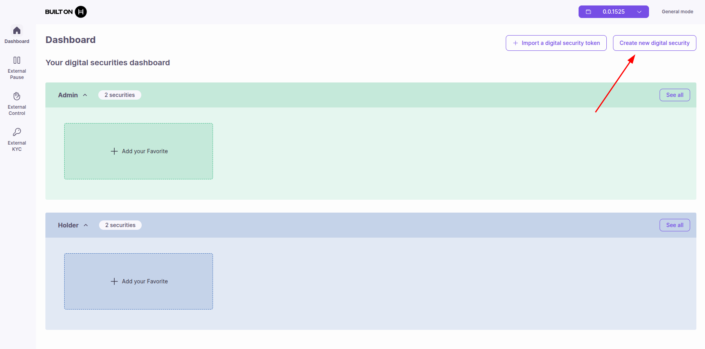
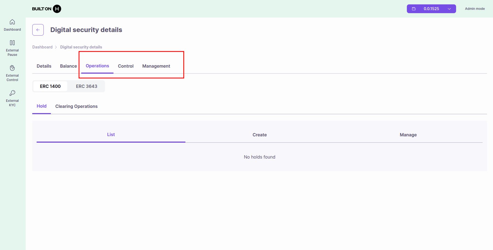

# Quick Start - Try the Asset Tokenization Studio

Quick start guide to run the Asset Tokenization Studio web application.

## Prerequisites

* **Node.js**: v20.19.4 or newer
* **npm**: v10.9.0 or newer
* **Hedera Account**: Testnet or mainnet account with HBAR
* **Hedera Wallet**:
  * MetaMask (connects directly), or
  * HashPack, Blade, or other wallets (connect via WalletConnect)

## Installation

### 1. Clone the Repository

```bash
git clone https://github.com/hashgraph/asset-tokenization-studio.git
cd asset-tokenization-studio
```

### 2. Install Dependencies

```bash
npm ci
```

### 3. Build Contracts and SDK

The ATS web application depends on the contracts and SDK:

```bash
npm run ats:contracts:build
npm run ats:sdk:build
```

## Configuration

### Create Environment File

```bash
cd apps/ats/web
cp .env.example .env
```

### Configure Environment Variables

Edit `apps/ats/web/.env`:

#### Network Configuration

```bash
# Hedera Network (testnet or mainnet)
VITE_NETWORK=testnet

# Hedera JSON-RPC Relay
VITE_JSON_RPC_RELAY_URL=https://testnet.hashio.io/api

# Hedera Mirror Node
VITE_MIRROR_NODE_URL=https://testnet.mirrornode.hedera.com
```

#### WalletConnect Configuration (Optional)

Required only if using HashPack, Blade, or other non-MetaMask wallets:

```bash
# Get your project ID from https://cloud.walletconnect.com
VITE_WALLET_CONNECT_PROJECT_ID=your_project_id_here
```

> **Note**: MetaMask connects directly and does not require WalletConnect configuration.

#### Contract Addresses

```bash
# Business Logic Resolver Contract ID
VITE_BUSINESS_LOGIC_RESOLVER_ID=0.0.12345678

# T-REX Factory Contract ID
VITE_TREX_FACTORY_ID=0.0.87654321
```

> **Note**: Replace the contract IDs with your deployed contract addresses. See the [Deployment Guide](../developer-guides/contracts/deployment.md) for instructions on deploying contracts.

#### Optional Configuration

```bash
# Application Port (default: 5173)
VITE_PORT=5173

# Enable Debug Mode
VITE_DEBUG=false
```

## Running the Application

### From Monorepo Root

```bash
npm run ats:web:dev
```

### From Web Directory

```bash
cd apps/ats/web
npm run dev
```

The application will be available at **http://localhost:5173**

### Application Interface

Once running, you'll see the ATS web application:


## First Steps

### 1. Connect Your Wallet

* Click "Connect Wallet" in the top right
* Select your preferred wallet:
  * **MetaMask**: Click "Connect with MetaMask" (direct connection)
  * **Other wallets**: Select HashPack, Blade, or other WalletConnect-compatible wallets
* Approve the connection request

### 2. Select Your View: Admin or Holder

ATS provides two operating modes:

* **Admin View (green)**: For token issuers and administrators to manage tokens, perform corporate actions, and configure settings
* **Holder View (blue)**: For token holders to view their balances and transfer tokens

You can switch between views from the dashboard by clicking the view selector.

### 3. Create a Security Token

* Navigate to "Create Token"
* Choose token type: **Equity** or **Bond**



* Fill in token details (name, symbol, supply)
* Configure compliance settings (KYC, transfer restrictions)
* Deploy the token

### 4. Manage Your Tokens

Once you've created tokens, you can manage them from the dashboard:


#### Selecting a Security Token

To perform operations on a security token, you must first select it:

* **From "See All" button**: Click "See All" to view all your tokens, then select the one you want to work with
* **From Favorites panel**: If you've marked a token as favorite, you can quickly select it from the favorites panel on the dashboard

#### Available Operations

Once security is selected, you can:

* View all tokens
* Perform operations
* Manage token holders and permissions

Available operations appear in tabs. The tabs you see depend on your assigned role:



## Troubleshooting

### Port Already in Use

```bash
# Kill process on port 5173
lsof -ti:5173 | xargs kill -9

# Or change port in .env
VITE_PORT=5174
```

### Build Errors

```bash
# Clean and rebuild
npm run ats:clean
npm run ats:build
```

### Wallet Connection Issues

* Ensure your wallet extension is installed and unlocked
* Check that you're connected to the correct network (testnet/mainnet)
* **MetaMask**: Connects directly without WalletConnect
* **HashPack/Blade/Other wallets**: Verify your WalletConnect project ID is configured in `.env`

### MetaMask: "Selected Account is not a Hedera account"

If you see this error when connecting MetaMask, you need to add the Hedera network to MetaMask:

**For Hedera Testnet:**

1. Open MetaMask
2. Click on the network dropdown (top left)
3. Click "Add Network" → "Add a network manually"
4. Fill in the following details:
   * **Network Name**: Hedera Testnet
   * **RPC URL**: `https://testnet.hashio.io/api`
   * **Chain ID**: `296`
   * **Currency Symbol**: HBAR
   * **Block Explorer URL**: `https://hashscan.io/testnet`
5. Click "Save"
6. Switch to the Hedera Testnet network
7. Try connecting again

**For Hedera Mainnet:**

1. Use the same steps as above with these details:
   * **Network Name**: Hedera Mainnet
   * **RPC URL**: `https://mainnet.hashio.io/api`
   * **Chain ID**: `295`
   * **Currency Symbol**: HBAR
   * **Block Explorer URL**: `https://hashscan.io/mainnet`

**Note**: This error can also occur if the mirror node is not correctly configured in your `.env` file. Verify the `REACT_APP_MIRROR_NODE` environment variable is set correctly.

### Contract Not Found

* Verify contract IDs in `.env` are correct
* Ensure contracts are deployed to the network you're using
* Check that the Business Logic Resolver and Factory are properly configured

## Next Steps

* [User Guides](../user-guides/index.md) - Learn how to create tokens and manage corporate actions
* [Developer Guides](../developer-guides/index.md) - Learn about the architecture and advanced features
* [API Documentation](../api/index.md) - Explore contract APIs

## Need Help?

* [GitHub Issues](https://github.com/hashgraph/asset-tokenization-studio/issues)
* [Hedera Discord](https://hedera.com/discord)
* [Documentation](../intro.md)
