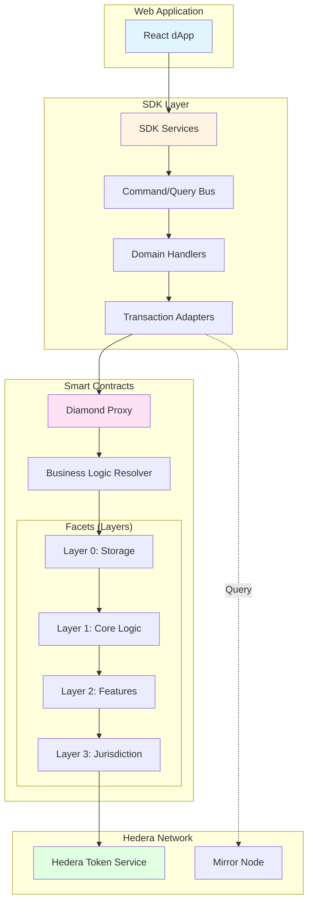
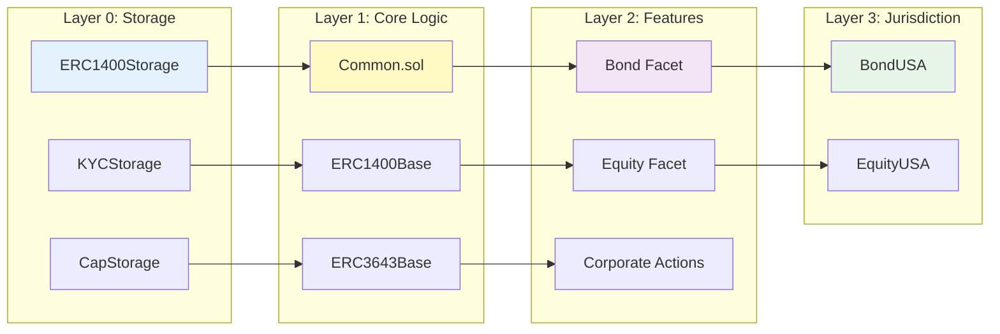
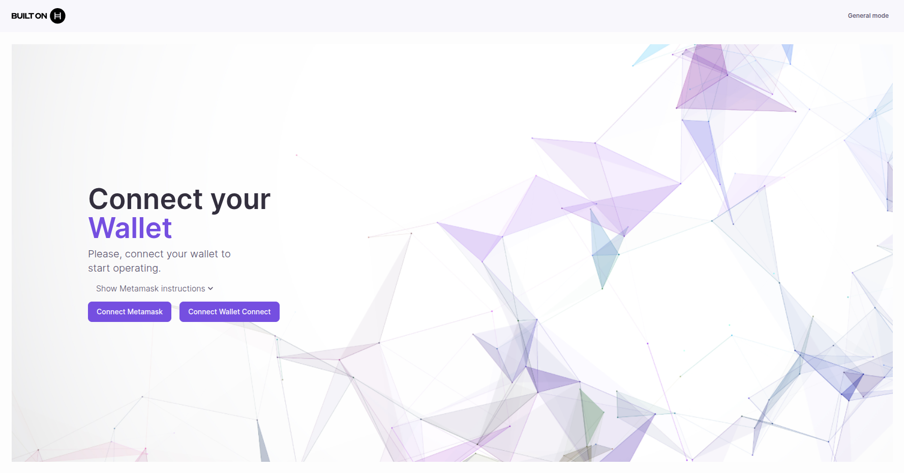

# Asset Tokenization Studio (ATS)

Create and manage tokenized securities (equities and bonds) on the Hedera network with full compliance and regulatory features.

## Overview

Asset Tokenization Studio (ATS) is a comprehensive platform for issuing, managing, and trading security tokens. Built on the Hedera network, ATS provides enterprise-grade infrastructure for tokenizing real-world assets while maintaining regulatory compliance.

### Key Features

* **Security Token Issuance**: Create equity and bond tokens compliant with ERC-1400 and ERC-3643 (T-REX) standards
* **Compliance Management**: Built-in KYC/AML verification and transfer restrictions
* **Corporate Actions**: Execute dividends, coupon payments, and token lifecycle events
* **Token Lifecycle Management**: Full control over token supply, transfers, freezing, and redemption
* **Diamond Pattern Architecture**: Modular, upgradeable smart contracts using EIP-2535
* **Multi-Custody Support**: Integration with DFNS, Fireblocks, AWS KMS, and WalletConnect

## Architecture

ATS consists of three main components:

### Smart Contracts

Solidity smart contracts deployed on Hedera using a **4-layer hierarchical design** with the Diamond Pattern (EIP-2535):

:::info Key Benefits

* **Modularity**: Each layer has a specific responsibility
* **Upgradeability**: Facets can be upgraded independently
* **Data Isolation**: Layer 0 separates storage from logic
* **Flexibility**: Easy to add new features or jurisdictions :::

[Learn more about contracts →](developer-guides/contracts/index.md)

### SDK

TypeScript SDK with hexagonal architecture and CQRS pattern:

* **Adapters**: Support for multiple transaction signers (RPC, WalletConnect, DFNS, Fireblocks, AWS KMS)
* **Command/Query Bus**: Separation of write and read operations
* **Feature Handlers**: 25+ domain handlers for all token operations
* **Dependency Injection**: Modular, testable architecture using tsyringe

[Learn more about SDK integration →](developer-guides/sdk-integration.md)

### Web Application

React-based dApp for end users:

* **Token Creation**: Intuitive UI for creating equity and bond tokens
* **Compliance Dashboard**: Manage KYC and transfer restrictions
* **Corporate Actions**: Execute dividends and coupon payments
* **Token Management**: Transfer, freeze, pause, and redeem tokens
* **Wallet Integration**: HashPack, Blade, and WalletConnect support

[Try the web app →](getting-started/quick-start.md)

## Use Cases

#### 📈 Equity Tokenization

Create and manage company shares on blockchain

* Create shares representing ownership
* Configure dividend distributions
* Manage voting rights and governance
* Enforce transfer restrictions

[Learn more](user-guides/creating-equity/)

#### 💰 Bond Tokenization

Issue debt securities with automated payments

* Issue bonds with custom terms
* Automate coupon payments
* Handle maturity redemption
* Track bondholder registry

[Learn more](user-guides/creating-bond/)

#### 🔒 Regulated Securities

Full compliance with global standards

* ERC-3643 (T-REX) compliance
* Identity verification and KYC
* Transfer rules by jurisdiction
* Accredited investor checks

[Learn more](user-guides/managing-compliance/)

## Getting Started

#### 👤 For End Users

Want to try the ATS web application and create tokens?

* Quick start in minutes
* No coding required
* Create and manage tokens
* Execute corporate actions

[Quick Start Guide](getting-started/quick-start/)

#### 👨‍💻 For Developers

Integrate ATS or contribute to the codebase

* Full development environment
* SDK integration
* Contract deployment
* Custom facet development

[Full Development Setup](getting-started/full-setup/)

## Documentation

#### 📚 User Guides

Step-by-step guides for using the ATS web application

* Creating equity and bond tokens
* Managing compliance and KYC
* Executing corporate actions
* Token lifecycle management

[View Guides](user-guides/)

#### 🛠️ Developer Guides

Technical guides for developers

* Smart contract deployment
* SDK integration and usage
* Architecture patterns
* Adding custom facets

[View Guides](developer-guides/)

#### 📖 API Documentation

Technical reference for contracts and SDK

* Smart contract interfaces
* SDK classes and methods
* Code examples
* Usage patterns

[View API Docs](api/)

## Standards and Compliance

ATS implements the following token standards:

* **ERC-1400**: Security Token Standard for regulated securities
* **ERC-3643 (T-REX)**: Token for Regulated EXchanges with on-chain compliance
* **EIP-2535**: Diamond Standard for upgradeable smart contracts

## Support and Resources

* [GitHub Repository](https://github.com/hashgraph/asset-tokenization-studio)
* [Report Issues](https://github.com/hashgraph/asset-tokenization-studio/issues)
* [Hedera Documentation](https://docs.hedera.com)
* [Hedera Discord](https://hedera.com/discord)

## License

Licensed under Apache License 2.0. See [LICENSE](https://github.com/hashgraph/asset-tokenization-studio/blob/main/LICENSE) for details.
