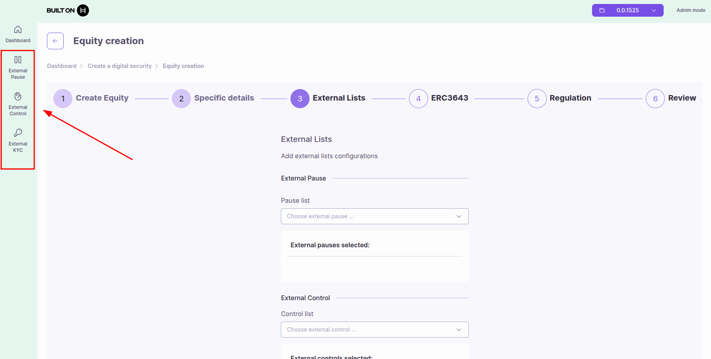

# Managing External Pause Lists

Learn how to create and manage external pause contracts that can control multiple asset tokens simultaneously.

## Overview

External Pause Lists are on-chain smart contracts that enable coordinated pausing across multiple assets. Instead of pausing each token individually, institutions can pause or unpause hundreds or thousands of assets at once through a single external pause contract.

### Key Features

- **Centralized Pause Control**: Pause multiple assets simultaneously from a single contract
- **Institutional Use Cases**: Ideal for platforms managing multiple tokens
- **Emergency Response**: Quick response to security incidents or regulatory requirements
- **System Maintenance**: Coordinate upgrades across all linked assets
- **Legal Compliance**: Meet regulatory requirements for coordinated halts

### Use Cases

**Multi-Asset Platforms**

- Tokenization platforms managing hundreds of securities
- Institutional issuers with multiple bond series
- Corporate entities with various equity classes

**Emergency Situations**

- Security vulnerabilities requiring immediate pause
- Regulatory investigations affecting all assets
- System-wide upgrades or maintenance

**Coordinated Operations**

- Platform-wide bug fixes across all assets
- Synchronized system updates
- Legal requirements for simultaneous halts

## How External Pause Works

### Architecture

Each asset token can be linked to multiple external pause contracts. Before executing any operation, the asset checks:

1. **Internal Pause**: Is the asset individually paused?
2. **External Pause Contracts**: Is any linked external pause contract active?

If **either** the internal pause is enabled **or any** external pause returns `isPaused() = true`, the asset is paused.

```
┌─────────────────────────────────────────────────────────────┐
│                    Asset Operation                          │
└─────────────────────┬───────────────────────────────────────┘
                      │
                      ▼
        ┌─────────────────────────┐
        │  Check Internal Pause   │
        └────────┬────────────────┘
                 │
                 ▼
        ┌─────────────────────────┐
        │ Check External Pause 1  │
        └────────┬────────────────┘
                 │
                 ▼
        ┌─────────────────────────┐
        │ Check External Pause 2  │
        └────────┬────────────────┘
                 │
                 ▼
        ┌─────────────────────────┐
        │   Any Pause Active?     │
        │   YES → Block           │
        │   NO → Allow            │
        └─────────────────────────┘
```

### How External Pause Status Works

When you create an external pause list, it has a simple activated/deactivated status:

**Status: Activated**

- All assets linked to this external pause list are **paused**
- No transfers or operations are allowed on linked assets
- Toggle to "Deactivated" to resume operations

**Status: Deactivated**

- All assets linked to this external pause list operate **normally**
- Transfers and operations are allowed (subject to other restrictions)
- Toggle to "Activated" to pause all linked assets

## Prerequisites

- ATS web application running and accessible
- Hedera wallet connected with sufficient HBAR
- **PAUSE_MANAGER_ROLE** on assets you want to link
- Understanding of your pause management requirements

## Accessing External Pause Lists

1. Navigate to the ATS web application
2. Click on **"External Pause"** in the sidebar menu



## Creating or Importing External Pause Lists

You have two options to add an external pause list:

### Option 1: Create New External Pause

Creates a new external pause list by deploying a smart contract automatically.

**Steps:**

1. Click **"Create"** button
2. Provide list details:
   - **List Name**: Descriptive name (e.g., "Platform Maintenance Pause", "Emergency Stop")
   - **Description** (optional): Purpose of this pause mechanism
3. **Configure initial status** - you will be asked to choose:
   - **Activated**: Anything linked to this pause list will be paused immediately
   - **Deactivated**: Assets linked to this pause list will operate normally - **Recommended for initial setup**
4. Click **"Deploy"** or **"Create"**
5. Approve the transaction in your wallet
6. The contract is deployed and appears in your External Pause list

**What happens:**

- A new external pause contract is deployed on-chain
- You become the manager of this pause contract
- The contract address is displayed (0x... or 0.0.xxxxx)
- You can now link assets to this pause list

**Understanding Activated vs Deactivated:**

- **If created ACTIVATED**: Any asset you link to this pause list will be paused immediately. All operations on those assets will be blocked until you deactivate the pause list.
- **If created DEACTIVATED**: Assets linked to this pause list will continue to operate normally. You can activate the pause later when needed.

> **Tip**: Start with "Deactivated" status, link your assets first, then activate when needed.

### Option 2: Import Existing External Pause

Use an existing external pause list by importing its contract ID.

**Steps:**

1. Click **"Import"** button
2. Enter the **Contract ID**: Hedera contract ID (0.0.xxxxx) or EVM address (0x...)
3. Click **"Import"**
4. Approve the transaction in your wallet
5. The external pause list appears in your list

**Use cases:**

- Use a pause contract deployed by another team member
- Connect to a platform-wide pause mechanism
- Share pause controls across multiple organizations

> **Note**: When importing, you may have view-only access unless you have admin permissions on the imported contract.

## Linking External Pause Lists to Tokens

After creating or importing an external pause list, you need to link it to your security tokens.

**Steps:**

1. Navigate to your **security token** from the dashboard
2. Go to the **"Control"** tab
3. Select the **"External Pause"** section
4. Click **"Add External Pause"** button
5. Select the external pause list from the dropdown
6. Click **"Add"** to confirm
7. Approve the transaction in your wallet

> **Required Role**: You must have **PAUSE_MANAGER_ROLE** on the token to link external pause lists.

## Managing External Pause Contracts

### View All External Pause Contracts

The **External Pause** dashboard displays all your pause contracts:

**Table Columns:**

- **Address ID**: Contract address (0x... or 0.0.xxxxx)
- **Status**: Active (paused) or Inactive (not paused)
- **Toggle Icon**: Click to activate/deactivate pause
- **Delete Icon**: Remove the pause contract

### Activate/Deactivate Pause

**To Activate Pause** (pause all linked assets):

1. Locate the pause contract in the table
2. Click the **toggle icon** to activate
3. Confirm the transaction in your wallet
4. All linked assets are immediately paused

**To Deactivate Pause** (resume operations):

1. Locate the pause contract in the table
2. Click the **toggle icon** to deactivate
3. Confirm the transaction in your wallet
4. All linked assets resume normal operations (if not paused internally)

> **Warning**: Activating a pause affects **all** assets linked to this contract. Ensure you understand the impact before toggling.

### Delete External Pause Contract

**To Remove a Pause Contract:**

1. Ensure all assets are unlinked from this contract
2. Click the **delete icon** next to the contract
3. Confirm deletion
4. Contract is removed from your list

> **Important**: You cannot delete a pause contract while assets are still linked to it. Unlink all assets first.

## Linking External Pause to Assets

### During Asset Creation

When creating a new equity or bond token, you can link external pause contracts:

**In Step 3: External Lists Configuration**

1. Navigate to the **Pause List** section
2. Select external pause contracts from the dropdown
3. Click **Add** to link to the new asset
4. Review linked pauses before deployment

See the asset creation guides for details:

- [Creating Equity Tokens](./creating-equity.md)
- [Creating Bond Tokens](./creating-bond.md)

### After Asset Deployment

You can link external pause contracts to existing assets:

**Prerequisites:**

- You must have **PAUSE_MANAGER_ROLE** on the asset

**Steps:**

1. Navigate to the asset details page
2. Click the **"External Pause"** tab (in Control Tabs section)
3. View currently linked external pause contracts

**To Add External Pause Contracts:**

1. Click **"Add external pause"** button
2. A modal appears with a dropdown
3. Select external pause contracts to link (can select multiple)
4. Click **"Add"** to confirm
5. Approve transaction in your wallet
6. Contracts are now linked to the asset

**To Remove External Pause Contracts:**

1. In the External Pause tab, select contracts from the list (left column checkboxes)
2. Click **"Remove items selected"** button
3. Confirm removal
4. Approve transaction in your wallet
5. Contracts are unlinked from the asset

## Roles and Permissions

### PAUSE_MANAGER_ROLE

This role is required to manage external pause links on an asset:

**Permissions:**

- Add external pause contracts to the asset
- Remove external pause contracts from the asset
- View linked external pause contracts

**Does NOT Grant:**

- Ability to activate/deactivate the external pause contract (requires pause contract ownership)
- Ability to pause the asset internally (requires PAUSER_ROLE)

### PAUSER_ROLE

This is a **different role** that controls the asset's **internal pause**:

**Permissions:**

- Pause/unpause the asset individually
- Does not affect external pause contracts

See [Roles and Permissions](./roles-and-permissions.md) for complete role details.

## Best Practices

### For Institutions Managing Multiple Assets

**Use External Pause for:**

- Platform-wide emergency stops
- Coordinated system maintenance
- Regulatory compliance across all assets
- Bug fixes affecting multiple tokens

**Strategy:**

1. Create one external pause contract per platform/category
2. Link all relevant assets to the contract
3. Use multi-signature wallet to control the pause
4. Document pause procedures and responsibilities
5. Test pause activation in non-production environment first

### Security Recommendations

**Access Control:**

- Use multi-signature wallets for production pause contracts
- Limit pause contract control to authorized personnel only
- Implement time-locks for pause deactivation (if needed)

**Testing:**

- Test pause activation on testnet first
- Verify all linked assets respond correctly
- Document rollback procedures

**Documentation:**

- Maintain list of all assets linked to each pause contract
- Document who has authority to activate pause
- Create runbooks for emergency pause scenarios

### Operational Guidelines

**Before Activating Pause:**

1. Notify stakeholders and users
2. Verify reason for pause is valid
3. Document the incident or maintenance reason
4. Ensure technical team is ready for resolution

**During Pause:**

1. Communicate status to users
2. Work on resolution/maintenance
3. Test fixes in isolated environment
4. Prepare for reactivation

**After Deactivating Pause:**

1. Verify all assets are operating correctly
2. Monitor for issues post-reactivation
3. Document resolution and lessons learned
4. Update procedures if needed

## Common Scenarios

### Scenario 1: Platform-Wide Upgrade

**Situation:** You need to upgrade smart contracts for 500 tokens

**Solution:**

1. Link all 500 tokens to a single external pause contract
2. Activate pause before upgrade
3. Perform upgrades on all contracts
4. Test thoroughly
5. Deactivate pause to resume operations

**Benefit:** Single action pauses all assets instead of 500 individual pauses

### Scenario 2: Security Incident

**Situation:** Security vulnerability discovered affecting all assets

**Solution:**

1. Immediately activate external pause (linked to all assets)
2. All assets halt operations instantly
3. Investigate and develop fix
4. Deploy fix to all affected contracts
5. Deactivate pause after verification

**Benefit:** Instant response across entire platform

### Scenario 3: Regulatory Investigation

**Situation:** Regulator requires halt of all trading pending investigation

**Solution:**

1. Activate external pause linked to all regulated assets
2. Provide regulator with proof of halt
3. Maintain pause during investigation period
4. Deactivate when cleared by regulator

**Benefit:** Compliance with regulatory requirements

### Scenario 4: Multiple Pause Categories

**Situation:** You have equities and bonds that need separate pause controls

**Solution:**

1. Create **External Pause A** for all equity tokens
2. Create **External Pause B** for all bond tokens
3. Link each asset type to its respective pause contract
4. Pause by category as needed

**Benefit:** Granular control over different asset types

## Common Issues

### External Pause Not Working

**Problem:** Activating external pause doesn't pause the asset

**Solutions:**

- Verify asset is correctly linked to the pause contract
- Check pause contract implements `IExternalPause` interface correctly
- Ensure `isPaused()` method returns `true` when activated
- Verify transaction was confirmed on-chain

### Cannot Remove External Pause

**Problem:** Unable to unlink external pause from asset

**Solutions:**

- Verify you have PAUSE_MANAGER_ROLE on the asset
- Check wallet has sufficient HBAR for transaction
- Ensure you're selecting the correct pause contract
- Try removing one contract at a time instead of bulk removal

### Asset Still Paused After Deactivation

**Problem:** Asset remains paused after deactivating external pause

**Solutions:**

- Check if asset is paused internally (separate from external pause)
- Verify no other linked external pause contracts are active
- Confirm deactivation transaction was successful
- Check pause contract status in block explorer

### Wrong Assets Linked

**Problem:** Accidentally linked wrong assets to pause contract

**Solutions:**

1. Navigate to each affected asset
2. Go to External Pause tab
3. Remove the incorrect pause contract link
4. Link to correct pause contract if needed

## Monitoring and Auditing

### Track Pause History

**What to Monitor:**

- When pause was activated/deactivated
- Who triggered the pause
- Which assets were affected
- Duration of pause periods

**Tools:**

- Blockchain explorer for transaction history
- Asset dashboard for current status
- External monitoring systems for alerts

### Alert Configuration

**Recommended Alerts:**

- External pause activated
- External pause deactivated
- Asset linked to new external pause
- Asset unlinked from external pause

## Next Steps

- [Creating Equity Tokens](./creating-equity.md) - Link external pause during equity creation
- [Creating Bond Tokens](./creating-bond.md) - Link external pause during bond creation
- [Managing External KYC Lists](./managing-external-kyc-lists.md) - Investor verification lists
- [Managing External Control Lists](./managing-external-control-lists.md) - Transfer control lists
- [Roles and Permissions](./roles-and-permissions.md) - Understanding PAUSE_MANAGER_ROLE
